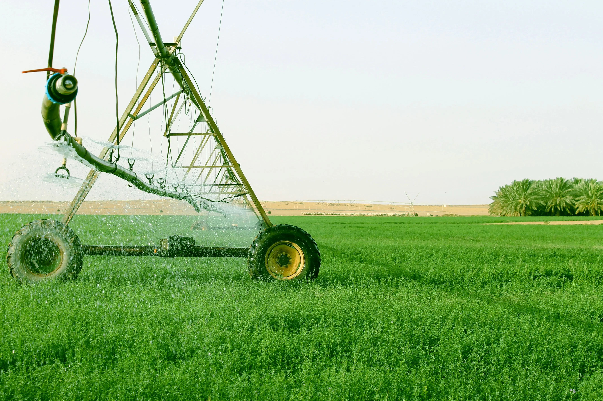

# DURFAM - Agricultural Management System

DURFAM is a comprehensive agricultural management system designed to help farmers and agricultural businesses streamline their operations. The platform provides tools for managing products, inventory, orders, and more.



## Features

- 🌾 **Product Management**: Easily organize and track agricultural products
- 📦 **Inventory Tracking**: Monitor stock levels and get low stock alerts
- 📋 **Order Management**: Process and track orders efficiently
- 📊 **Analytics Dashboard**: Get insights into your agricultural business
- 🔐 **Secure Authentication**: Built-in user authentication and authorization

## Tech Stack

- **Frontend**: [Next.js 15](https://nextjs.org/) with React 19
- **Styling**: [Tailwind CSS](https://tailwindcss.com/) with [shadcn/ui](https://ui.shadcn.com/)
- **Database**: [Supabase](https://supabase.com/) (PostgreSQL)
- **Authentication**: Supabase Auth
- **State Management**: React Hooks
- **Icons**: [Lucide Icons](https://lucide.dev/)
- **Forms**: React Hook Form
- **AI Integration**: OpenAI API

## Prerequisites

Before you begin, ensure you have installed:
- [Node.js](https://nodejs.org/) (v18 or higher)
- [pnpm](https://pnpm.io/) (v8 or higher)

## Getting Started

1. **Clone the repository**
   ```bash
   git clone https://github.com/yourusername/agricultural-management.git
   cd agricultural-management
   ```

2. **Install dependencies**
   ```bash
   pnpm install
   ```

3. **Set up environment variables**
   ```bash
   cp .env.example .env.local
   ```
   Fill in your environment variables in `.env.local`:
   - Get OpenAI API key from [OpenAI Platform](https://platform.openai.com/account/api-keys)
   - Get Supabase credentials from your project settings at [Supabase](https://app.supabase.com)

4. **Set up the database**
   - Create a new project in [Supabase](https://app.supabase.com)
   - Run the SQL commands from `lib/database.sql` in your Supabase SQL editor

5. **Run the development server**
   ```bash
   pnpm dev
   ```
   Open [http://localhost:3000](http://localhost:3000) in your browser.

## Project Structure

```
agricultural-management/
├── app/                  # Next.js app directory
│   ├── products/        # Product management pages
│   ├── inventory/       # Inventory management pages
│   ├── orders/         # Order management pages
│   └── dashboard/      # Dashboard and analytics
├── components/          # Reusable React components
├── lib/                 # Utility functions and API
├── public/             # Static assets
└── styles/             # Global styles
```

## Key Features Explained

### Product Management
- Add, edit, and delete agricultural products
- Categorize products (seeds, fertilizers, equipment)
- Track product inventory and pricing

### Inventory System
- Real-time stock tracking
- Low stock alerts
- Inventory value calculation
- Stock history and trends

### Order Processing
- Create and manage customer orders
- Track order status
- Generate order reports
- Customer management

## Contributing

1. Fork the repository
2. Create your feature branch (`git checkout -b feature/AmazingFeature`)
3. Commit your changes (`git commit -m 'Add some AmazingFeature'`)
4. Push to the branch (`git push origin feature/AmazingFeature`)
5. Open a Pull Request

## License

This project is licensed under the MIT License - see the [LICENSE](LICENSE) file for details.

## Support

For support, email support@durfam.com or join our Slack channel.

## Acknowledgments

- [Next.js Documentation](https://nextjs.org/docs)
- [Tailwind CSS](https://tailwindcss.com/)
- [Supabase](https://supabase.com/)
- [shadcn/ui](https://ui.shadcn.com/) 